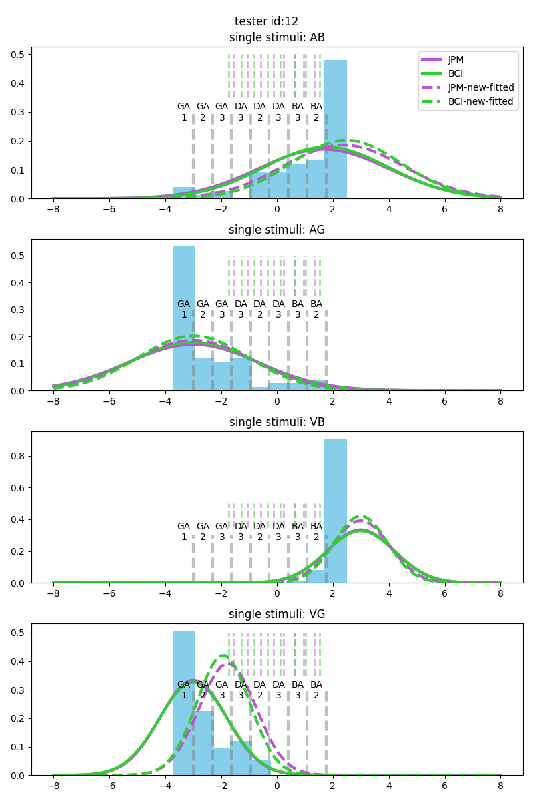
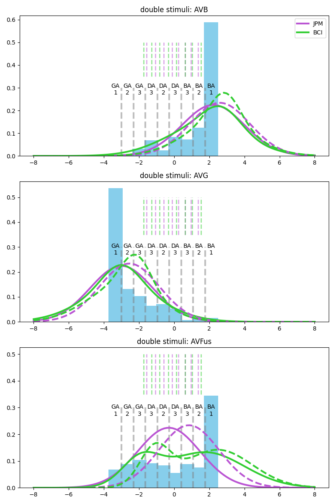
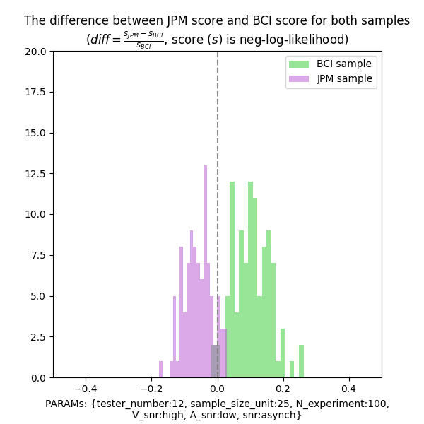

# Bayesian-Models-of-Audiovisual-Integration-in-Speech-Perception
special course project - DTU 

supervised by Tobias Andersen & Agata Wlaszczyk

based on Alma's work: https://journals.plos.org/plosone/article/authors?id=10.1371/journal.pone.0246986

worklog: https://docs.google.com/spreadsheets/d/12fZfqtgxMTg6rTjENT-Q2yRCTC252KaY4XWu0jumSAk/edit#gid=0

## Target problem

From Alma's work, we see both JPM and BCI model could fit the response data quite well, indicating both of them have the ability to estimate the internal logic of audio-visual perception. However, this conclusion might be limited due to the insufficient trails for each condition as well as the rough-classified responses. To explore whether there's a significant difference between these two models over audio-visual perception, we suggest to build a pilot experiment using stimulated data from cognitive models before conduct the complicated cognitive experiment, and address the degree of confidence about the models' consistency. We also hope the correctness of model would be explored through this experiment. 

There are mainly x phases for building this experiment. 

### Phase 1: Re-build the models

### Phase 2: Get the estimated parameters using testers' responses

### Phase 3: Visualize the difference of models with their distributions

### Phase 4: Generate samples from re-built models

Steps for this Phase:

1. We could observe from the visualization that when *snr* equals *"VHigh + ALow"* and with *asynchrony* condition. And for tester No.5,6,7,12, the differences of model distribution are much more obvious. Therefore, we would restrict the condition to asychnocy with VhighAlow. 
2.  Use the best parameters from the fitting process, generate 25\*3 samples for single stimuli (only take the high quality for visual stimuli and low quality for audio stimuli), and 25\*5\*2 samples for fusion stimuli for only Vhigh-Alow snr. The sample size here are set to match the original total size of the responses. 
3. Assign the samples into 9 categories, the boundaries are set by evenly dividing from $\mu_{ag}$ to $\mu_{ab}$. 
4. Store the counts and probabilities as the similar format as the original data responses.  

### Phase 5: Fit the stimulated sample to JPM and BCI respectively and compare the result 

#### 5.1 Model re-fitting

##### 5.1.1 re-fitting procedure

##### 5.1.2 re-fitting results

Fitted models with tester No.12; samples are generated from BCI model.

#### 5.2 Result Analysis

##### 5.2.1 The definition of $s_M$  (the score of a model)

The score for evaluating the model is the value of negative log likelihood. Here we compute two types of negative log likelihood, 1) only for fusion condition, 2) the sum of all conditions. 
$$
s_{M_{fusion}} = -log\mathcal{L_{fusion}} \\
s_M = -\sum_{c\in{C}}log\mathcal{L_c}
$$
where $c$ represents the conditions, $C$ represents the collection of all conditions. 

According to the definition of likelihood, the larger the likelihood is, the better the model is. In our case, with the negative log likelihood, the smaller the $s_M$ is, the better the model is. 

##### 5.2.2 Comparison over the difference of scores from 2 models

The first method we use to comparison the results over 2 models is computing the difference between the score from 2 models. 

We define the new comparison factor $diff$ as below:
$$
diff = \frac{s_{JPM}-s_{BCI}}{s_{BCI}}
$$
Considering there's two kinds of $s_M$ and they have different numerical range, we divide the difference by the score of BCI model to normalize all value into the range of $[-1,1]$.  Based on the definition of $s_M$, we'll know that when $diff<0$, meaning JPM fits the sample better; otherwise, BCI model fits the sample better. 

The plot below shows the distribution of $diff$ for both BCI and JPM samples for tester No.12 with the score type of $s_{M_{fusion}}$. As clearly showed in the plot, for most of JPM samples, JPM fits the sample better; and the same story happen to BCI samples as well. Still, there's a small area of overlapping showing in the plots, indicating that for some samples generated from model A, it turned out that model B got the better fitting result. We'll analyze the certainty of one model 'wins' the other in the following section 5.2.4. 

##### 5.2.3 ROC curve analysis

Another way of analyzing the refitting result is simply checking the ROC curve. From signal detection theory, the ROC curve is used for measure the sensitivity between two signals (or one signal and one noise). Just as the plot shows below, when curve is more close to the diagonal, two signals are more similar to each other. 

The plot below shows the ROC curve for 16 tester.

## Things need to get done (updated on 6.11)

1. Two ways for examination. A) as what we did this week. B) test the roc (roc also could be used for testing other distributions) .   
   1. the examination on fitting performance
      * exam on 16(?) tester {at least on 5,6,7,12, maybe also 0,1,2,3,10}
      * do it for 100 experiment
      * 
   2. ROC
      * not like the A method, we don't need to fit the model again (from what I understand). Instead, we only sampled from the distribution, and then compute the proportions and take the inversed value for Gaussian coordinate 
      * This is for examining whether the distribution is Gaussian or not
      * question: what is the noise
      * *updated: error bar
      * *updated: 100 trails with error bar with all 16 testers
2. Try with only neg log for fusion. (done)
3. Increase or decrease the sample size unit and see what is the threshold for distinguish the two models 

(updated on 6.15)

4. statistics on 16 testers 

   for each tester, run one experiment from BCI and JPM samples, and compute the p-value for the hypothesis that one model wins.

   do this for 100 trails.

{plan for 6.22

* to-do-list 4. statistics, about how to define hypothesis and how to get the p-value 

* ROC 100 trails + error bar

* write the report Phase 1& 2, overleaf}

   

### Statistics 
